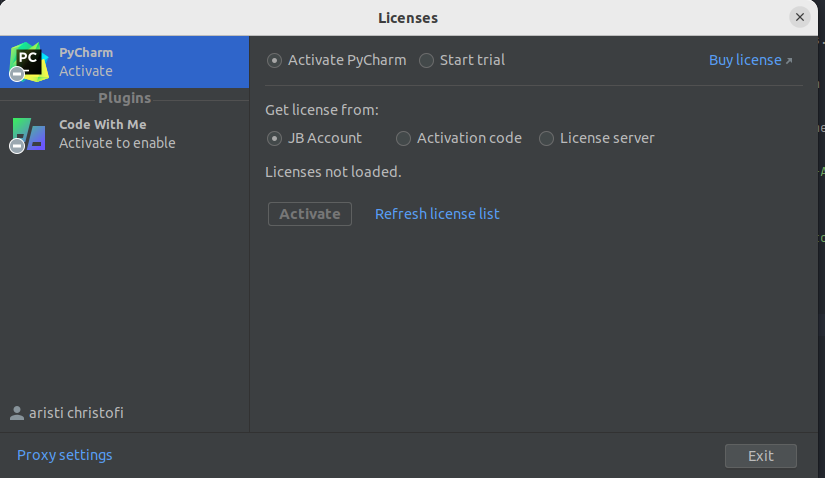

# Tools

# Webstorm Editor

### Linux OS (operating system)

Download the Webstorm Editor (normally must-pay, but we have crack)

https://www.jetbrains.com/webstorm/

For starting Webstorm

For opening first time Webstorm

Open a Terminal `Ctl+Alt+T` and go to the folder you extracted the
downloaded tar of Webstorm Editor

``cd ~Downloads/webstorm-<...> ``

``./bin/webstorm.sh``

When you arrive at `Licences Screen`,

you have to select `License Server`

on `Server Address` put the value `http://147.102.124.19:64001` and then
click `Activate`

and everything is OK.

If you make something else, you can find the above `License Server` screen
ig you go to `Help-->Register`

### Windows OS (operating system)

First download a `git bash` which is a console very similar to `Linux bash`

You can find how to do it here: https://www.simplilearn.com/tutorials/git-tutorial/git-installation-on-windows

Download the Webstorm Editor (normally must-pay, but we have crack)

https://www.jetbrains.com/webstorm/

For starting Webstorm, you have to find the .exe file.

When you arrive at `Licences Screen`,

you have to select `License Server`

on `Server Address` put the value `http://147.<message me on discord>` and then
click `Activate`

and everything is OK.

If you make something else, you can find the above `License Server` screen
ig you go to `Help-->Register`

Generally `Go Linux` and also `vegan`
